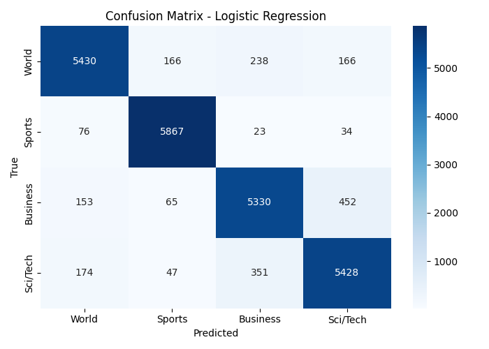

# 📝 Text Classification Project – Internship Challenge

Ky projekt është një klasifikues tekstual i ndërtuar me Python, duke përdorur **TF-IDF** për vectorization dhe **Logistic Regression / Naive Bayes** për modelim.  
Qëllimi është ndërtimi i një pipeline të thjeshtë **AI/ML**: nga pastrimi i të dhënave, trajnimi i modelit, deri te parashikimi i kategorive të reja.

---

## 📂 Dataset

Ky projekt përdor dataset-in publik **AG News Classification Dataset**:  
🔗 [Link Dataset](https://www.kaggle.com/amananandrai/ag-news-classification-dataset)

Dataset-i përmban **4 kategori**:
- 🌍 World  
- 🏀 Sports  
- 💼 Business  
- 💻 Sci/Tech  

Çdo kategori ka mijëra mostra, me gjithsej **120,000 train samples** dhe **7,600 test samples**.

---

## ⚙️ Hapat kryesorë

1. **Përgatitja e të dhënave**
   - Bashkimi i `title + description`
   - Pastrimi i tekstit (lowercase, heqja e URL-ve, numrave, shenjave të pikësimit, hapësirave ekstra)

2. **Analiza eksploruese**
   - Numri i mostrave për kategori
   - Mostra të para nga dataset-i

3. **Trajnimi i modeleve**
   - **TF-IDF Vectorization** (1–2 grams, min_df=5, max_df=0.9)  
   - Modelet e përdorura:
     - Logistic Regression
     - Naive Bayes (MultinomialNB)

4. **Evaluimi**
   - Accuracy
   - Precision, Recall, F1-score
   - Confusion Matrix për Logistic Regression

5. **Predikim manual**
   - Funksioni `predict(text)` që parashikon kategorinë për një fjali të dhënë.

---

## 📊 Rezultatet

### Logistic Regression
- Accuracy: **91.9%**
- Performancë e lartë në `Sports` dhe `World`, gabime kryesisht mes `Business` ↔ `Sci/Tech`

### Naive Bayes
- Accuracy: **90.7%**
- Pak më e ulët se Logistic Regression, por ende rezultat shumë i mirë

---

### 🔍 Confusion Matrix (Logistic Regression)



*(shembull nga output-i: shumica e gabimeve janë mes Business dhe Sci/Tech)*

---

### 📈 Krahasimi i Modeleve


- **Logistic Regression**: 91.9%  
- **Naive Bayes**: 90.7%  

---

## ▶️ Përdorimi

1. Klono repo-n:
   ```bash
   git clone https://github.com/leoneberisha/text-classification-project
   cd text-classification-project
